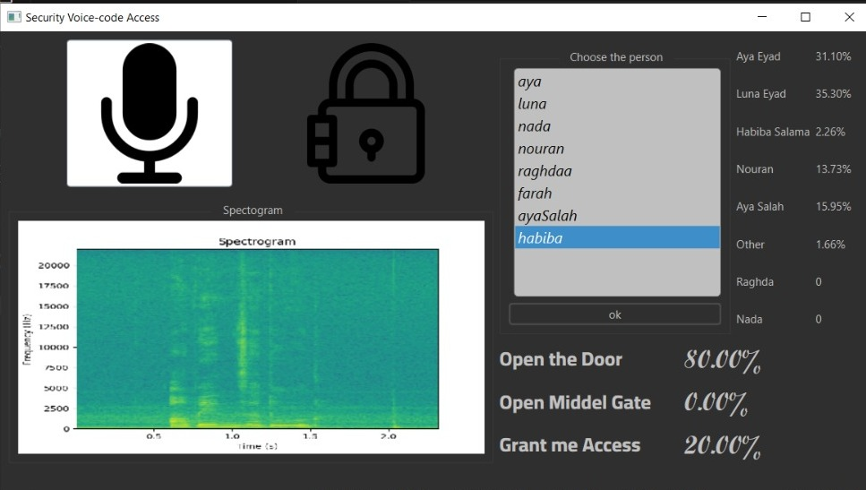

# Security_Voice_Code_Access

The Security Voice-code Access software component is designed to provide access control based on voice recognition using fingerprint and spectrogram concepts. It can be trained on 8 individuals and operates in two modes:

## Mode 1: Security Voice Code

In this mode, access is granted only when a specific pass-code sentence is spoken. The valid passcode sentences are:
- "Open the door"
- "Unlock middel gate"
- "Grant me access"

## Mode 2: Security Voice Fingerprint

In this mode, access is granted to specific individuals who speak the valid passcode sentence. The software allows users to select which individual(s) among the original 8 users are granted access. Access can be granted to one or more individuals.

## User Interface (UI) Elements

The UI provides the following elements:

1. **Voice Recording Button:** Initiates voice recording for the passcode.
2. **Spectrogram Viewer:** Displays the spectrogram of the spoken voice-code.
3. **Analysis Results Summary:**
   - Table showing the percentage of match between the spoken sentence and each of the three saved passcode sentences.
   - Table showing the percentage of match between the spoken voice and each of the 8 saved individuals.
4. **Access Status Indicator(Locker icon):** Displays whether access is gained or denied based on the algorithm results.

## Implementation Details

- The software utilizes fingerprint and spectrogram concepts for voice recognition.
- It can be trained on 8 individuals.
- The UI allows users to choose individuals for access.
- Access is granted based on the match between spoken voice and saved passcodes or individuals.
- Passcode sentences and individual voice fingerprints are stored for comparison during access control.

## Dependencies

- Python 3.x
- PyQt6
- NumPy
- SciPy
- Matplotlib
- PyAudio

## Usage

1. Run the software application.
2. Choose the specific individuals who speak the valid passcode sentence.
3. Start recording the passcode using the provided button(microphon icon).
4. View the spectrogram of the spoken passcode.
5. Analyze the results displayed in the UI.
6. Access will be granted or denied based on the algorithm results.

